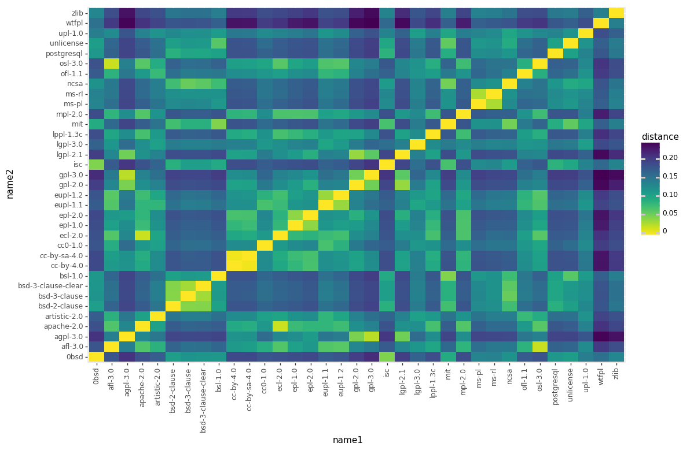

# Normalized compression distance (NCD)

Normalized compression distance (NCD) is a way of measuring the similarity between two sequences.

A [compression algorithm](https://en.wikipedia.org/wiki/Data_compression) looks for patterns and repetitions in the input sequence to compress it. For example, instead of "abababab" we can say "(ab)x4". This is how [RLE](https://en.wikipedia.org/wiki/Run-length_encoding) works and this is most simple and illustrative aexample of compression. Main idea of NCD is that a good compression algorithm compress concatenation of two sequences as good as they similar and much better than each sequence separately.

This conception was presented in the [Clustering by Compression](https://homepages.cwi.nl/~paulv/papers/cluster.pdf) paper by [Rudi Cilibrasi](https://cilibrar.com/) and [Paul Vitanyi](https://en.wikipedia.org/wiki/Paul_Vit%C3%A1nyi).

## Calculation

$$NCD_{Z}(x,y)={\frac  {Z(xy)-\min\\{Z(x),Z(y)\\}}{\max\\{Z(x),Z(y)\\}}}.$$

+ `x` and `y` -- input sequences.
+ `Z(x)` -- size of compressed `x`.

So, how it works:

1. We calculate size of compressed concatenation of two sequences.
1. We subtract from this size the minimal size of these compressed sequences. Some properties of value on this step:
  1. If it is equal to the maximal size of these compressed sequences it means that size of concatenation's compression is equal to sum of sizes of separate compression of each sequences. That is, compression algorithm couldn't compress input data at all.
  1. If it is equal to 0 then concatenation's compressed size is the same as the compressed size of each of these sequences. It means that these sequences are the same.
1. We divide result from previous step by the maximal size of these compressed sequences to normalize results. So, for the same sequences we will get 0, and for different -- 1.

## Normal Compressor

Ok, but what is `Z`? This is the size of compressed data by normal compressor (`C`). Yeah, you can use any compression algorithm, but for non-normal compressors you will get strange and non-comparable results. So, there are these properties:

1. Idempotency: `C(xx) = C(x)`. Without it you wouldn't get 0 for the same sequences because `Z(xx) - Z(x) ≠ 0`.
2. Monotonicity: `C(xy) ≥ C(x)`. If you can find `C(xy) < C(x)` then `Z(xy) - min(Z(x), Z(y))` will be less than zero and all NCD will be less than zero.
3. Symmetry: `C(xy) = C(yx)`. Without it `NCD(xy) ≠ NCD(yx)`. You can ignore this property if you change `Z(xy)` on `min(Z(xy), Z(yx))` in the formula.
4. Distributivity: `C(xy) + C(z) ≤ C(xz) + C(yz)`. I'm not sure about this property. I guess, this shows that compression really works and make compressed data not larger than input sequence. Also, I think, there should be `Z` instead of `C` (as for "Symmetry" property). So, we can say it simpler: `Z(xy) ≤ Z(x) + Z(y)`.

So, none of the real world compressors really works for NCD:

1. Idempotency can't be satisfied without dropping out information that `x` sequence appears twice in the input data.
1. Monotonicity can be broken by header information of compressed data.
1. Symmetry also doesn't work for most of compressors because concatenation of sequences can make a new pattern. For example, for RLE `C("abb" + "bbc") = "ab4c"` and `C("bbc" + "abb") = "b2cab2"`.
1. For any real compressor we will get discrete `Z` that equals to the size in bites of compressed data, but this discretization make more difficult to make difference between short sequences.

So, what can we use? In the original paper authors used real compressors like `Zlib` because these properties approximately work for really big and quite random sequences. But can we do it better?

## Entropy

[Entropy](https://bit.ly/1dm77MT)

$$S=-\sum \_{i}P\_{i}\log {P_{i}}$$

## Use entropy in NCD


## Let's practice!

```python
>>> from textdistance import entropy_ncd
```

The same sequences have 0 distance, totally different -- 1:

```python
>>> entropy_ncd('a', 'a')
0.0
>>> entropy_ncd('a', 'b')
1.0
>>> entropy_ncd('a', 'a' * 40)
0.0
```

More differences -- higher distance:

```python
>>> entropy_ncd('text', 'text')
0.0
>>> entropy_ncd('text', 'test')
0.1
>>> entropy_ncd('text', 'nani')
0.4
```

Distance depends on the size difference between strings:

```python
>>> entropy_ncd('a', 'bc')
0.792481250360578
>>> entropy_ncd('a', 'bcd')
0.7737056144690833
>>> entropy_ncd('a', 'bbb')
0.8112781244591329
>>> entropy_ncd('a', 'bbbbbb')
0.5916727785823275
>>> entropy_ncd('aaaa', 'bbbb')
1.0
```

Sometimes Entropy-based NCD gives non-intuitive results:

```python
>>> entropy_ncd('a', 'abbbbbb')
0.5097015764645563
>>> entropy_ncd('a', 'aaaaaab')
0.34150514509881796
>>> entropy_ncd('aaaaaaa', 'abbbbbb')
0.6189891221936807
```

## Most similar licenses

Let's compare texts of licenses from [choosealicense.com](https://choosealicense.com/):

```bash
git clone https://github.com/github/choosealicense.com.git
```

We will get name of license as command line argument, compare its text with text of each other license and sort results by distance:

```python
from itertools import islice
from pathlib import Path
from sys import argv
from textdistance import entropy_ncd

# read files
licenses = dict()
for path in Path('choosealicense.com', '_licenses').iterdir():
  licenses[path.stem] = path.read_text()

# compare all with one
compare_with = argv[1]
distances = dict()
for name, content in licenses.items():
  distances[name] = entropy_ncd(
    licenses[compare_with],
    content,
  )

# show 5 most similar
sorted_distances = sorted(distances.items(), key=lambda d: d[1])
for name, distance in islice(sorted_distances, 5):
  print('{:20} {:.4f}'.format(name, distance))
```

Ok, let's have a look on some licenses:

```bash
$ python3 compare.py gpl-3.0
gpl-3.0              0.0000
agpl-3.0             0.0013
osl-3.0              0.0016
cc0-1.0              0.0020
lgpl-2.1             0.0022

$ python3 compare.py mit    
mit                  0.0000
unlicense            0.0031
bsl-1.0              0.0061
bsd-3-clause-clear   0.0066
ncsa                 0.0070

$ python3 tmp.py bsd-2-clause
bsd-2-clause         0.0000
postgresql           0.0041
bsd-3-clause         0.0054
isc                  0.0070
0bsd                 0.0073
```

Now, let's make heatmap!

```python
distances = []
for name1, content1 in licenses.items():
  for name2, content2 in licenses.items():
    distances.append((name1, name2, entropy_ncd(content1, content2)))

import plotnine as gg
import pandas as pd

df = pd.DataFrame(distances, columns=['name1', 'name2', 'distance'])

(
  gg.ggplot(df)
  + gg.geom_tile(gg.aes(x='name1', y='name2', fill='distance'))
  # reverse colors
  + gg.scale_fill_continuous(
    palette=lambda *args: gg.scale_fill_continuous().palette(*args)[::-1],
  )
  + gg.theme(
    figure_size=(12, 8),  # make chart bigger
    axis_text_x=gg.element_text(angle=30),  # rotate ox labels
  )
)        
```



## Further reading

1. [Clustering by Compression](https://homepages.cwi.nl/~paulv/papers/cluster.pdf)
1. [Compression-based Similarity](https://homepages.cwi.nl/~paulv/papers/ccp11.pdf)
1. [Article on the Wikipedia](https://en.wikipedia.org/wiki/Normalized_compression_distance)
1. [Discussion about NCD with Rudi Cilibrasi](https://github.com/orsinium/textdistance/issues/21)
